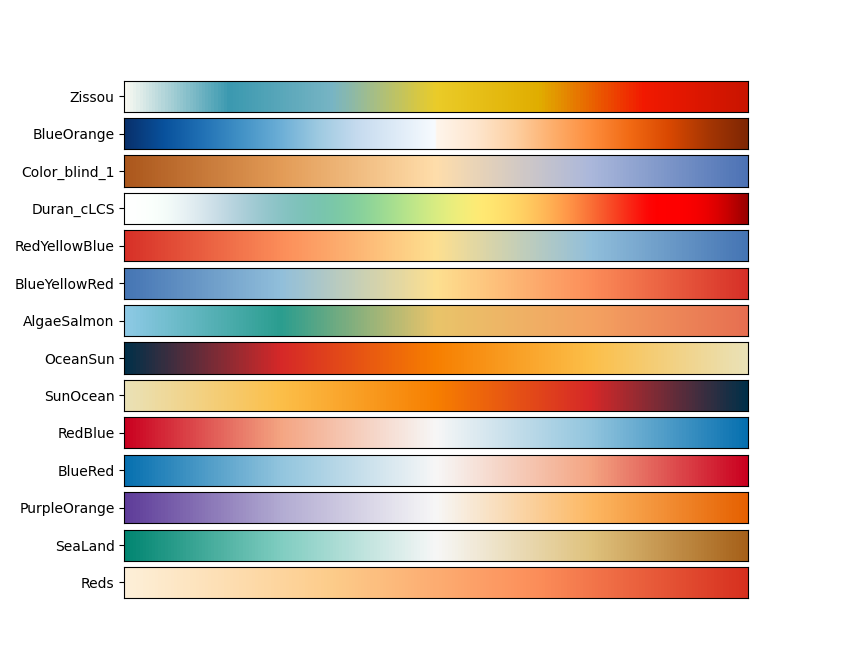

# Lagrangian_Analyses

- [Lagrangian\_Analyses](#lagrangian_analyses)
  - [Description](#description)
  - [Conda Installation](#conda-installation)
  - [Docker Image](#docker-image)
  - [Contents](#contents)
    - [Lagrangian\_Analyses](#lagrangian_analyses-1)
    - [notebooks](#notebooks)
      - [data](#data)
      - [output](#output)
  - [References](#references)
  - [Additional info](#additional-info)
      - [Personalised colourmap options ](#personalised-colourmap-options-)

## Description
Repository containing the Lagrangian Analyses used on Montaño Orozco, M. M. (2023). Hydrodynamics and coastal dispersion from the Bay of Plenty, Aotearoa, New Zealand: A 25-year numerical modelling perspective (Thesis, Doctor of Philosophy). University of Otago. Retrieved from http://hdl.handle.net/10523/16243. 

[For a better formatted version of the thesis (working embedded links) please click here](https://drive.google.com/file/d/1WMgq2lu7K5MjGTy6O5YpoKDkONDclkHo/view?usp=sharing)

In Chapter 2, 3 and 4 of this thesis lagrangian analyses were performed. All the lagrangian particle releases were done using OpenDrift.

The analyses done for chapter 3 "A climatological baseline of the simulated Eulerian and Lagrangian coastal Bay of Plenty" can be found here [github.com/MireyaMMO/cLCS](https://github.com/MireyaMMO/cLCS)

Analyses and calculations covered in this repository regarding chapter 2 and chapter 4 include:
- Absolute and relative dispersion
- PDF (Probability Density Functions)
- Connectivity Matrices
- Dispersal Kernels
- Stranded Particle data (average duration before stranding and locations)


## Conda Installation
To use this package OpenDrift is necessary. To facilitate and make the installation faster please use [mamba](https://github.com/conda-forge/miniforge). 
Example of how to install on Unix-like platforms (Mac OS & Linux):
```
curl -L -O "https://github.com/conda-forge/miniforge/releases/latest/download/Miniforge3-$(uname)-$(uname -m).sh

bash Miniforge3-$(uname)-$(uname -m).sh
```
*Accessed: December 2023

Once mamba is installed we can proceed.

This research was part of the [Moana Project](www.moanaproject.org), therefore the reader used for OpenDrift is especific to a reader developed by [Simon Weppe](https://github.com/simonweppe) for the project use. However, unless working with the same dataset or a data related to the Moana project I invite you to download the repository directly from OpenDrift

OpenDrift original repo
```
git clone https://github.com/OpenDrift/opendrift.git
```

Branch developed by Simon Weppe
```
git clone https://github.com/simonweppe/opendrift.git
```

The [environment.yml](https://github.com/MireyaMMO/Lagrangian_Analyses/blob/main/environment.yml) file contains all the dependencies needed to run opendrift and cLCS scripts.
```
cd ../
git clone https://github.com/MireyaMMO/Lagrangian_Analyses.git 
cd Lagrangian_Analyses
mamba env create --name Lagrangian --file=environment.yml
pip install --no-deps -e .
cd ../opendrift
pip install --no-deps -e .
```

## Docker Image
To build a local docker image:
```
docker build -f Dockerfile -t lagrangian:$tag .
```

To pull a working docker image from the current repository

Moana Version (developed by Simon Weppe)
```
docker pull mmontao/lagrangian:MOANA-v1.0.0   
```
OpenDrift
```
docker pull mmontao/lagrangian:v1.0.0   
```

And run. $tag can be v1.0.0, MOANA-v1.0.0 or if built locally the chosen tag
```
docker run -ti mmontao/lagrangian:$tag bash
```

## Contents
### [Lagrangian_Analyses](https://github.com/MireyaMMO/Lagrangian_Analyses/tree/main/Lagrangian_Analyses)
  - [opendrift.py](https://github.com/MireyaMMO/Lagrangian_Analyses/blob/main/Lagrangian_Analyses/opendrift.py) contains the `opendrift_run` class that deploys particles using OpenDrift.
  - [get_connectivity_statistics.py](https://github.com/MireyaMMO/Lagrangian_Analyses/blob/main/Lagrangian_Analyses/get_connectivity_statistics.py) contains the class `get_connectivity_statistics` which uses the OpenDrift output file to calculate the 2D Probability Density Function Connectivity Matrix and coefficient of variance, plus some stranded/settled particles statistics. 
  - [get_dispersal_kernel.py](https://github.com/MireyaMMO/Lagrangian_Analyses/blob/main/Lagrangian_Analyses/get_dispersal_kernel.py) contains the class `get_dispersal_kernel` which uses the OpenDrift output file to calculate the dispersal kernel for each location. 
  - [get_dispersion_statistics.py](https://github.com/MireyaMMO/Lagrangian_Analyses/blob/main/Lagrangian_Analyses/get_dispersion_statistics.py) contains the class `get_dispersion_statistics` which uses the OpenDrift output file to calculate the relative and absolute dispersion for each location.
  - [utils.py](https://github.com/MireyaMMO/Lagrangian_Analyses/blob/main/Lagrangian_Analyses/utils.py) contains some utility functions used accross the different classes such as `haversine`, `sp2xy`,  `xy2sph` and `get_colourmap`. The latter contains [personalised colourmap options ](#personalised-colourmap-options-) for a different variety of colourmaps (see Additional info). 
### [notebooks](https://github.com/MireyaMMO/Lagrangian_Analyses/tree/main/notebooks)
  - [01_opendrift_run.ipynb](https://github.com/MireyaMMO/Lagrangian_Analyses/blob/main/notebooks/01_opendrift_run.ipynb): Jupyter Notebook containing an example of how to use [opendrift_run](https://github.com/MireyaMMO/Lagrangian_Analyses/blob/main/Lagrangian_Analyses/opendrift.py)
  - [02_connectivity_statistics.ipynb](https://github.com/MireyaMMO/Lagrangian_Analyses/blob/main/notebooks/02_lagrangian_statistics.ipynb): Jupyter Notebook containing an example of how to use [get_connectivity_statistics](https://github.com/MireyaMMO/Lagrangian_Analyses/blob/main/Lagrangian_Analyses/get_connectivity_statistics.py).
  - [03_dispersal_kernel.ipynb](https://github.com/MireyaMMO/Lagrangian_Analyses/blob/main/notebooks/03_dispersal_kernel.ipynb): Jupyter Notebook containing an example of how to use [get_dispersal_kernel](https://github.com/MireyaMMO/Lagrangian_Analyses/blob/main/Lagrangian_Analyses/get_dispersal_kernel.py).
  - [04_dispersion_statistics.ipynb](https://github.com/MireyaMMO/Lagrangian_Analyses/blob/main/notebooks/04_dispersion_statistics.ipynb): Jupyter Notebook containing an example of how to use [get_dispersion_statistics](https://github.com/MireyaMMO/Lagrangian_Analyses/blob/main/Lagrangian_Analyses/get_dispersion_statistics.py).
#### data
- `%yyyy%mm_Particles_40_nb.nc`
Contains the data needed to replicate the PDF, Connectivity Matrix and coefficient of variance for the January experiment as seen in Chapter 4 of Montano et al 2023. Map of regions shown below. However to reduce the size of the repository only the years from 2010 to 2020 are added. 

#### output
Contains the output obtained from each of the jupyter notebooks mentioned above 
  - [notebook_01](https://github.com/MireyaMMO/Lagrangian_Analyses/tree/main/notebooks/output/notebook_01)
    - [200301_Particles_control.nc](https://github.com/MireyaMMO/Lagrangian_Analyses/tree/main/notebooks/output/notebook_01/200301_Particles_control.nc) OpenDrift output
    - [200401_Particles_control.nc](https://github.com/MireyaMMO/Lagrangian_Analyses/tree/main/notebooks/output/notebook_01/200401_Particles_control.nc)
  - [notebook_02](https://github.com/MireyaMMO/Lagrangian_Analyses/tree/main/notebooks/output/notebook_02)
    -  [CM_control.p](https://github.com/MireyaMMO/Lagrangian_Analyses/tree/main/notebooks/output/notebook_02/CM_control.p) Connectivity Matrix pickle file
    -  [PDF_control.p](https://github.com/MireyaMMO/Lagrangian_Analyses/tree/main/notebooks/output/notebook_02/PDF_control.p) PDF pickle file
    -  [Stranded_particles_data_control.p](https://github.com/MireyaMMO/Lagrangian_Analyses/tree/main/notebooks/output/notebook_02/Stranded_particles_data_control.p) Pickle file containing information regarding the particles stranded. 
  - [notebook_03](https://github.com/MireyaMMO/Lagrangian_Analyses/tree/main/notebooks/output/notebook_03)
    - [GDK_control.p](https://github.com/MireyaMMO/Lagrangian_Analyses/tree/main/notebooks/output/notebook_03/GDK_control.p) Pickle file containing a dictionary with the Gaussian Dispersal Kernel information for each location.
  - [notebook_04](https://github.com/MireyaMMO/Lagrangian_Analyses/tree/main/notebooks/output/notebook_04)
    - [AD_control.p](https://github.com/MireyaMMO/Lagrangian_Analyses/tree/main/notebooks/output/notebook_04/AD_control.p) Pickle file containing a dictionary with the Absolute Dispersion information for each location.
    - [RD_control.p](https://github.com/MireyaMMO/Lagrangian_Analyses/tree/main/notebooks/output/notebook_04/RD_control.p) Pickle file containing a dictionary with the Relative Dispersion information for each location.

## References
**Moana Project - BoP Study**
- [Work in progress] Montaño M. M., Suanda, S. H., de Souza, J. M. A. C., Duran R. "A climatological baseline of the quasi-steady Lagrangian transport patterns in a large coastal embayment."
- [Work in progress] Montaño M. M., Suanda, S. H., de Souza, J. M. A. C. "Hydrodynamic and behaviour parametrization effects on modelled coastal connectivity."
- Montaño, M. M., Suanda, S. H., and Souza, J. M. A. C. d. (2023). Modelled coastal circulation and Lagrangian statistics from a large coastal embayment: The case of Bay of Plenty, Aotearoa New Zealand. Estuarine, Coastal and Shelf Science, 281, [10.1016/j.ecss.2023.108212](https://doi.org/10.1016/j.ecss.2023.108212). 
- Montaño Orozco, M. M. (2023). Hydrodynamics and coastal dispersion from the Bay of Plenty, Aotearoa, New Zealand: A 25-year numerical modelling perspective (Thesis, Doctor of Philosophy). University of Otago. Retrieved from http://hdl.handle.net/10523/16243. 

[For a better formatted version of the thesis (working embedded links) please click here](https://drive.google.com/file/d/1WMgq2lu7K5MjGTy6O5YpoKDkONDclkHo/view?usp=sharing)

- Moana Project Data on [THREDDS](http://thredds.moanaproject.org:6443/thredds/catalog/moana/catalog.html) 


## Additional info
#### Personalised colourmap options 